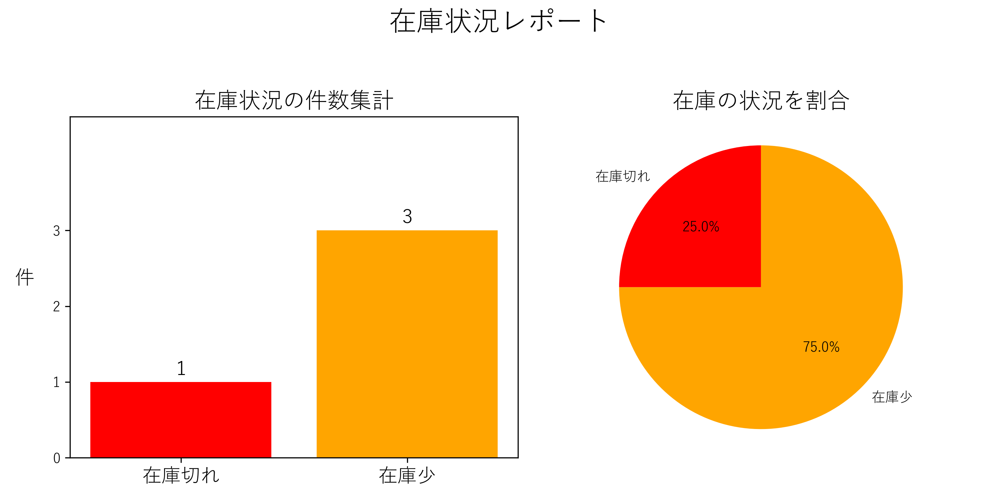

# 📦 在庫管理ツール（Excel VBA）＋ 📊 グラフ可視化（Python）

Excelで在庫判定を行い、CSV出力した結果をPythonでグラフ化するツールです。

VBAで在庫の状態（在庫切れ・在庫少・正常）を判定し、
結果をシート表示とCSV出力します。
そのCSVをPythonで読み込み、棒グラフと円グラフで可視化します。

---

## 📋 機能一覧

### ■ VBA（在庫管理）

* 在庫切れ（0）・在庫少（5以下）・正常を判定
* 在庫数が数値でない場合はエラー表示して処理を停止
* 判定結果をExcelシートに書き込み
* 判定結果に応じてセルの色を変更（在庫切れ：赤／在庫少：黄）
* 在庫切れ・在庫少の商品を resultシートに一覧出力
* 在庫切れ件数・在庫少件数を表示
* resultシートをCSVファイル（result.csv）として出力
* 表示を見やすくするために太字・背景色・罫線・列幅調整・中央揃えを使用

---

### ■ Python（グラフ作成）

* result.csv を読み込み
* 在庫切れ・在庫少の件数を集計
* 棒グラフを作成（件数表示あり）
* 円グラフを作成
* グラフ画像（inventory_summary.png）として保存

---

## 🗂️ ファイル構成

inventory-check/

```
├── stock.xlsm
├── Module1.bas
├── analyze_inventory.py
├── result_sample.csv
└── inventory_summary.png
```
---

## 🚀 使い方

### ① VBA（在庫判定）

1. `stock` シートに商品名と在庫数を入力
2. マクロ `RunInventoryCheck` を実行
3. resultシートに一覧と件数が表示される
4. `result.csv` が生成される

---

### ② Python（グラフ作成）

```bash
python analyze_inventory.py
```

---

## 📄 入力データ例（stockシート）

| 商品名   | 在庫数 |
| ----- | --- |
| ペン    | 3   |
| 消しゴム  | 0   |
| コピー用紙 | 2   |
| 付箋    | 1   |

---

## 📊 出力例（resultシート）

| 商品名   | 在庫数 | 判定   |
| ----- | --- | ---- |
| ペン    | 3   | 在庫少  |
| 消しゴム  | 0   | 在庫切れ |
| コピー用紙 | 2   | 在庫少  |
| 付箋    | 1   | 在庫少  |

---

## 📈 出力画像（inventory_summary.png）

棒グラフと円グラフを1枚にまとめた画像です。



---

## 💡 工夫したポイント

* 数値以外の入力をチェックし、エラー時は処理を停止するようにした
* 判定結果をシートに書き込むだけでなく、色分けして見やすくした
* resultシートに一覧と件数をまとめて表示した
* 表示を見やすくするためにレイアウトを調整した
* CSV出力時の確認ダイアログを表示しないようにした

---

## 🛠️ 開発環境

* Windows 11
* Excel（VBA）
* Python 3.x
* pandas
* matplotlib

---

## 👤 作者

[lucky-momo-2026](https://github.com/lucky-momo-2026)
